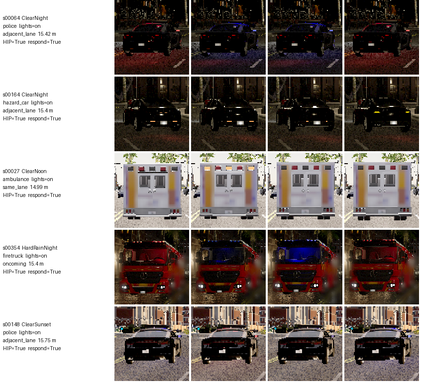
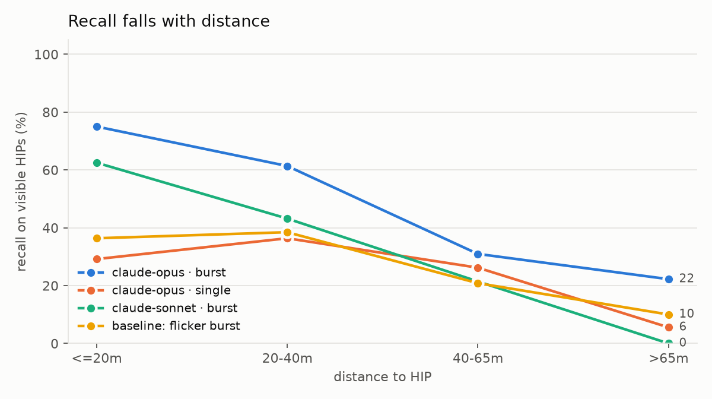

# HIP detection benchmark in CARLA

Can a vision model tell when an autonomous car is looking at a **High Illumination Priority (HIP)**
object, such as an emergency vehicle with its lights on or a car with its hazards on, and whether
the car has to react?

This repository builds that question into a reproducible benchmark using the
[CARLA simulator](https://carla.org/). CARLA places a HIP at a controlled distance and lane relative to
the ego car, under controlled lighting and weather. It records a short burst of camera frames and labels
every sample automatically from simulator state. Any detector (an API vision-language model, a
human, or a classical baseline) is then scored against those labels.

## Results (October 2026 run)

442 scenarios were collected in Town10HD: 4 weathers × 4 HIP types × lights on/off × 3 placements × 4 distances, plus scenes with no HIP. That gives 170 samples with a visible lit HIP and 272 without. Every sample was labelled with three Claude models (Opus, Sonnet, Haiku), each run as a **blinded labeller** through Claude Code sub-agents. A labeller saw only randomly renamed frames plus the same prompt the API backends send, never the scenario or the label. Each model was run twice: once on the first frame only, and once on the 4-frame burst. The colour/flicker baselines were fitted on the even-indexed half and are reported on the odd half.


*Four frames, 0.15 s apart, cropped around the HIP. Emergency light bars and hazard blinkers change between frames; a single frame often catches them dark.*

| predictor | input | recall | precision | FPR | F1 | respond-F1 | ego-lane acc |
|---|---|---|---|---|---|---|---|
| Claude Opus | **4-frame burst** | **49.4** | 78.5 | 8.5 | **60.6** | **62.5** | **99.3** |
| Claude Opus | single frame | 25.3 | 62.3 | 9.6 | 36.0 | 37.3 | 97.5 |
| Claude Sonnet | 4-frame burst | 34.1 | 76.3 | 6.6 | 47.2 | 48.9 | 77.6 |
| Claude Sonnet | single frame | 18.8 | 60.4 | 7.7 | 28.7 | 29.4 | 53.2 |
| Claude Sonnet | single frame, red/blue swapped (old bug) | 18.8 | 62.7 | 7.0 | 29.0 | 30.6 | 58.4 |
| Claude Haiku | 4-frame burst | 20.6 | 55.6 | 10.3 | 30.0 | 31.7 | 52.0 |
| Claude Haiku | single frame | 20.6 | 55.6 | 10.3 | 30.0 | 31.7 | 48.0 |
| flicker baseline (no learning) | 4-frame burst | 27.2 | 58.1 | 14.0 | 37.0 | – | – |
| colour baseline (no learning) | single frame | 28.3 | 34.2 | 38.8 | 31.0 | – | – |

All numbers are percentages over 442 samples (baselines: 221 test samples). The full breakdowns are in
[`results/summary.md`](results/summary.md) and the raw per-sample predictions in `results/predictions/`.



**What the data says**

1. **Showing a burst instead of one frame roughly doubles what the stronger models catch.** Opus recall goes
   from 25% to 49% and Sonnet from 19% to 34%, while false positives stay flat or drop. Both differences are
   significant in a paired McNemar test (Opus p = 5·10⁻⁶: 68 samples fixed vs 24 broken; Sonnet p = 5·10⁻⁴).
   Haiku gains nothing (p = 1). With a single frame, a strobe is often caught in its dark phase, and the models
   (correctly) refuse to call a vehicle with dark lights a HIP.
2. **Even the best setting misses half the HIPs.** Recall falls from 75% at ≤20 m to 22% beyond 65 m, where a
   vehicle is only ~10–20 px tall at 640×480. Hazard-light cars are the hardest class: Opus catches 15% even
   with a burst, because blinkers are small and amber against tail lights.
3. **False alarms come from lights-off emergency vehicles.** FPR on empty scenes is under 2% for Opus and Sonnet (5% for Haiku), but
   16–30% on fire trucks and ambulances with their lights off. The models partly answer "is this an emergency vehicle?"
   rather than "are its lights on?".
4. **The colour bug in the 2025 code did not change detection.** Feeding the swapped-channel images that the old
   pipeline produced gives the same recall (18.8% vs 18.8%, McNemar p = 0.90). It was a real bug and is fixed,
   but light *patterns* matter more to the models than light *colours*.
5. **Lane reasoning separates the models more than detection does.** Opus identifies the ego lane 99% of the
   time; Sonnet 53–78%; Haiku ~50%.
6. **Hand-written flicker detection is weak here.** CARLA's low-quality software rendering (used because this
   run had no GPU) adds strong per-pixel frame-to-frame noise, so even a denoised flicker detector only
   reaches AUC 0.57. That is an artefact of the setup, not a property of real cameras, but it means the
   baseline numbers should not be over-read.

**Caveats.** The scenes are synthetic, static (all vehicles stopped), from a single town, and rendered at low
quality on CPU. "Claude via sub-agents" sees the same pixels and prompt as the API backend would, but a
sub-agent labels a batch of 8–32 items in one context, so items are not perfectly independent. The models
were referred to by family (Opus/Sonnet/Haiku) as served by Claude Code at the time of the run. GPT-4.1 / GPT-4o
were not evaluated because the run environment had no OpenAI access. The OpenAI backend is implemented
(`openai:gpt-4.1`) but untested.

## Where to take this next

* **Run the API backends** (`scripts/run_model.py`) on GPT-4.1/4o and Claude to get a cross-vendor table, and
  rerun collection on a GPU at Epic quality to remove the rendering noise.
* **Longer and denser bursts** (8–16 frames, or video input): the burst effect is the headline result, so its
  dose–response curve is the obvious next experiment.
* **Moving traffic and more towns.** `scripts/live.py` already drives the ego car with emergency vehicles on
  its route and logs every decision next to simulator ground truth. In a test run, the flicker baseline fired
  on 70% of windows with no HIP in view, because camera motion looks like flicker. A moving-camera benchmark
  needs a motion-compensated or learned detector.
* **A trained detector baseline** (e.g. a YOLO model fine-tuned on these CARLA crops plus a temporal head), which
  is what a paper would need to compare against.
* **Related work to position against:** active emergency vehicle detection with per-frame CNNs plus temporal
  smoothing ([arXiv 2212.13696](https://arxiv.org/abs/2212.13696)); VLMs as driving agents (*On the Road with
  GPT-4V(ision)*, DriveLM, DriveMLM); and the US DOT report on how automated vehicles should respond to
  emergency vehicles.


## How it works

```
configs/*.yaml ──► scripts/collect.py ──► data/<run>/            (frames + samples.jsonl with ground truth)
                                            │
          scripts/run_model.py  (API VLMs) ─┤
          scripts/blind_batches.py (agents / humans, blinded)
          scripts/run_baselines.py (colour / flicker)
                                            ▼
                                  results/predictions/*.jsonl ──► scripts/evaluate.py ──► results/summary.md
                                                                   scripts/make_figures.py ──► results/figures/
```

**Scenarios** (`hipdet/scenarios.py`). The grid is a full factorial over weather/time of day, HIP type
(ambulance, police, fire truck, car with hazards), lights on/off, placement (same lane, adjacent
same-direction lane, oncoming lane) and distance, plus scenes with no HIP. Vehicles with their lights off
are hard negatives: an emergency vehicle with its lights off is *not* a HIP. Each scenario has its own
seed, so the dataset is reproducible.

**Capture** (`hipdet/collect.py`). The world runs in synchronous mode with a fixed time step. For each
sample the collector spawns the ego car, the HIP and distractor traffic, then saves a burst of 4 RGB frames
0.15 s apart. The burst matters because flashing is the defining property of a HIP, and a single still
cannot show it.

**Ground truth** (`hipdet/ground_truth.py`). A pixel-aligned instance-segmentation camera measures how
many pixels the HIP actually covers, so labels reflect what is *visible* rather than what was spawned. The
rules, which the prompt also states:

* A HIP is an emergency vehicle with its emergency lights on, or any vehicle with its hazard lights on,
  covering at least 40 pixels.
* The car must respond if the HIP is in its own lane or a same-direction lane, or if it is an
  emergency vehicle in oncoming traffic, within 100 m.
* Lanes are numbered from the left, counting only same-direction driving lanes.

**Models** (`hipdet/vlm/`). There is one prompt and one strict JSON output schema for all backends:
OpenAI (`openai:gpt-4.1`), Anthropic (`anthropic:claude-opus-5-5`), and a `swap_rb:` wrapper that reproduces
the old colour bug on purpose. `scripts/blind_batches.py` exports randomly renamed frames with the same
instructions for evaluation through any interface without API access, e.g. Claude Code sub-agents or human
labellers.

**Baselines** (`hipdet/baselines.py`). There are two non-learned detectors. The first scores bright,
saturated red/blue light in one frame. The second scores coloured light whose brightness *changes*
across the burst. Their thresholds are fit on half the data and evaluated on the other half.

## Running it

Requirements: a CARLA **0.9.16** server and Python 3.10–3.12.

```bash
pip install -r requirements.txt
./CarlaUE4.sh -RenderOffScreen            # in the CARLA folder; a GPU makes this ~50x faster

python scripts/collect.py --config configs/pilot.yaml --out data/pilot          # a few minutes
python scripts/collect.py --config configs/benchmark.yaml --out data/benchmark  # resumable

python scripts/run_baselines.py --data data/benchmark
python scripts/run_model.py --data data/benchmark --backend openai:gpt-4.1 --mode single
python scripts/run_model.py --data data/benchmark --backend openai:gpt-4.1 --mode burst
python scripts/evaluate.py --data data/benchmark
python scripts/make_figures.py --compare openai_gpt-4.1__single openai_gpt-4.1__burst baseline_flicker_burst

python scripts/live.py --detector flicker --seconds 60   # ego car drives; detector runs on a worker thread
python -m pytest tests                                    # no simulator needed
```

`OPENAI_API_KEY` / `ANTHROPIC_API_KEY` must be set for the API backends.

## Repository layout

| path | what it is |
|---|---|
| `hipdet/` | the library: CARLA helpers, scenarios, ground truth, collection, VLM backends, baselines, metrics |
| `scripts/` | command-line entry points (collect, run models, evaluate, figures, live demo, map plot) |
| `configs/` | scenario grids (`pilot.yaml` small, `benchmark.yaml` main) |
| `results/` | per-sample labels (`dataset/`), predictions, metrics, summary tables and figures from the run above |
| `tests/` | unit tests for everything that does not need the simulator |
| `legacy/` | the original 2025 scripts and `hip_log.csv`, kept for reference |

## What changed from the 2025 version

The original scripts (now in `legacy/`) spawned emergency vehicles at random map points and sent a few
seconds of frames to GPT-4o/4.1. A human then typed a score into `hip_log.csv`. Issues fixed along the way:

* **Red and blue were swapped in every image sent to the model.** CARLA delivers BGRA. The old code
  dropped alpha and handed BGR to PIL as RGB, so red ambulance lights reached the model as blue and blue
  police lights as red. The PNGs saved to disk were correct, so it was invisible when checking by eye.
* `filter('dodge')[0]` could return a civilian Dodge Charger instead of the police car. Blueprints are now
  exact ids.
* HIPs spawned at random map points were almost never in view, so `hip_log.csv` is ~95% empty frames.
* Asynchronous mode with "every 60th frame" made capture timing machine-dependent. Runs are now synchronous
  and seeded.
* The prompt contradicted itself on when to respond, and its examples were not valid JSON. Replies were
  regex-scraped. There is now one rule set, a strict schema, and tolerant parsing that counts failures
  instead of crashing.
* The hand-entered score is replaced by automatic ground truth and standard metrics with confidence
  intervals.
